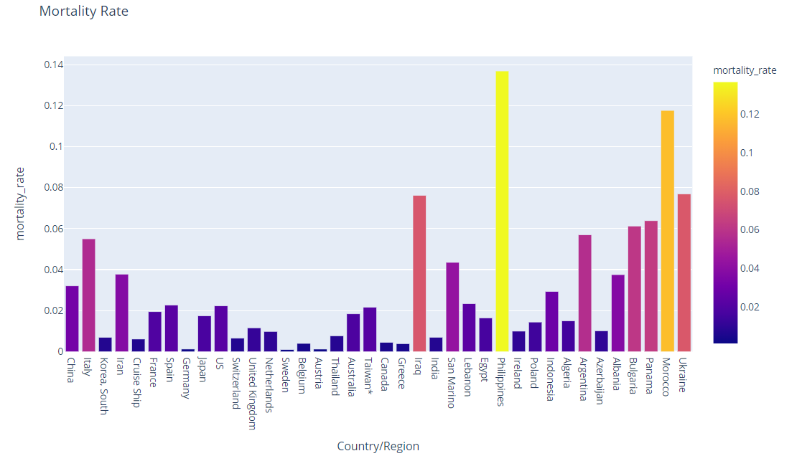
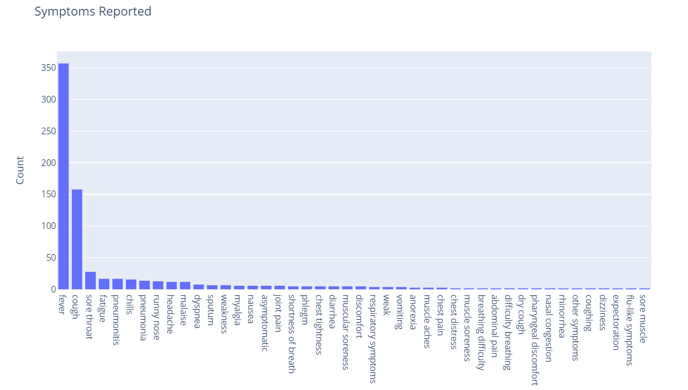
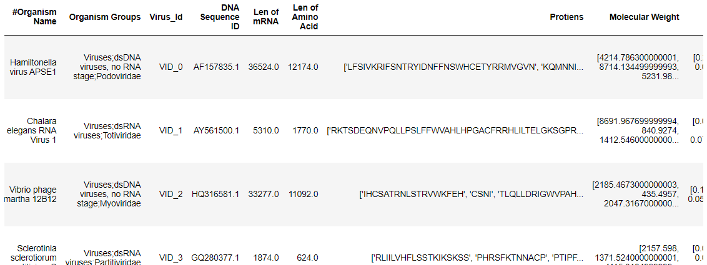

# Analysis-of-COVID-19-and-NLP-based-genome-matching

### Information From WHO
- Coronavirus disease (COVID-19) is an infectious disease caused by a new virus. The disease causes respiratory illness (like the flu) with symptoms such as a cough, fever, and in more severe cases, difficulty breathing.

- You can protect yourself by washing your hands frequently, avoiding touching your face, and avoiding close contact (1 meter or 3 feet) with people who are unwell.

- Coronavirus disease spreads primarily through contact with an infected person when they cough or sneeze. It also spreads when a person touches a surface or object that has the virus on it, then touches their eyes, nose, or mouth.

## *Note: Anyone can clone this repository. Help stop the spread of this pandemic by contributing.* 
### Please contact me if you want the dataset that I've created. However one can create the Bio Data with the code given.

# Results 
## Spread of Corona Virus over time

## Mortality Rate in Each Countries in the order of number of confirmed cases.

## Most Frequent Symptoms Reported

## BIO Python For Analysis of Genome Sequences
1. DNA is the genetic material of all cellular organisms.
Deoxyribonucleic acid (DNA) is the material substance of inheritance. All cellular organisms use DNA to encode and store their genetic information. DNA is a chemical compound that resembles a long chain, with the links in the chain made up of individual chemical units called nucleotides. The nucleotides themselves have three components: a sugar (deoxyribose), phosphate, and a nucleobase. The bases come in four chemical forms known as adenine, cytosine, guanine, and thymine, which are frequently simply abbreviated as A, C, G and T. The order, or “sequence”, of bases encodes the information in DNA.

2. RNA ”carries” information
DNA holds information, but it generally does not actively apply that information. DNA does not make things. To extract the information and get it to the location of cellular machinery that can carry out its instructions (usually the blueprints for a protein, as we will see below) the DNA code is “transcribed” into a corresponding sequence in a “carrier” molecule called ribonucleic acid, or RNA. The portions of DNA that are transcribed into RNA are called “genes”.

3. RNA molecules made in a cell are used in a variety of ways.
For our purposes here, there are three key types of RNA: messenger RNA, ribosomal RNA, and transfer RNA. Messenger RNA (mRNA) carries the instructions for making proteins. Like DNA, proteins are polymers: long chains assembled from prefab molecular units, which, in the case of proteins, are amino acids. A large molecular machine* called the ribosome translates the mRNA code and assembles the proteins. Ribosomes read the message in mRNA in three letter “words” called codons, which translate to specific amino acids, or an instruction to stop making the protein. Each possible three letter arrangement of A,C,U,G (e.g., AAA, AAU, GGC, etc) is a specific instruction, and the correspondence of these instructions and the amino acids is known as the “genetic code.”

## Note The code will fetch the genome sequence of all the virus from NCBI website.
***A rich feature set is created using genome information from the fetched sequence using BioPython.***
**Organism DNA Sequence ID,Len of mRNA, Len of Amino Acid, Protiens, Molecular Weight, Aromaticity,	Amino Acid Freq, IsoElectric Point**

